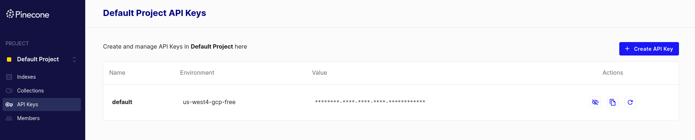
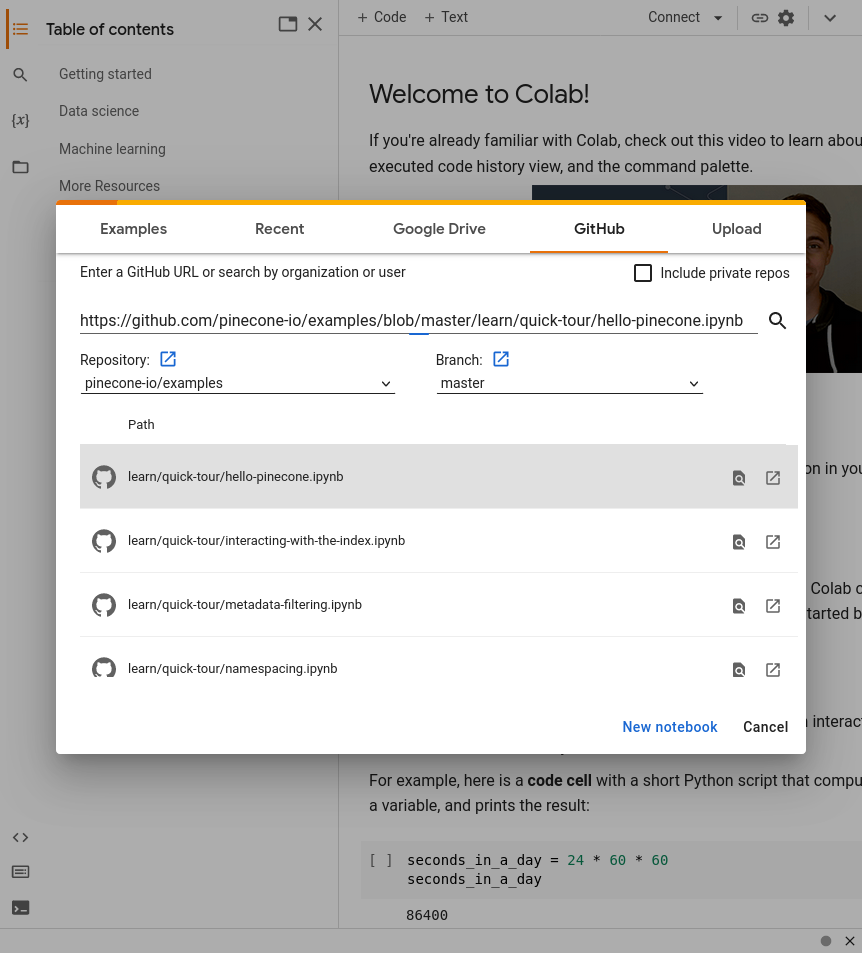
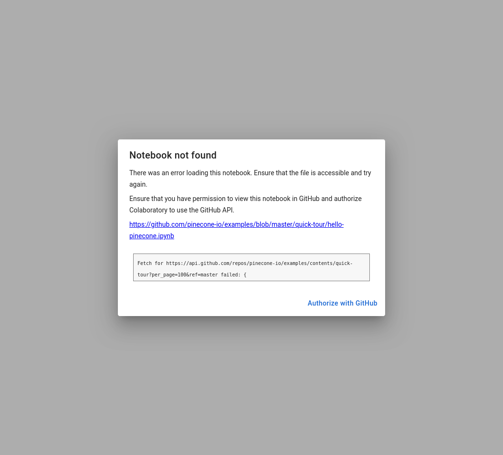
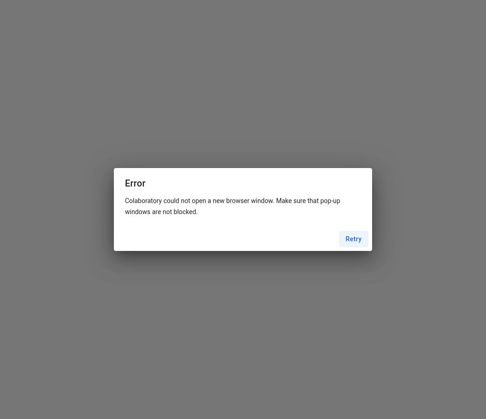
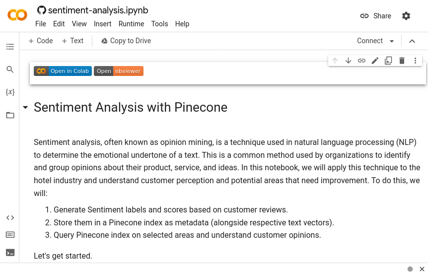
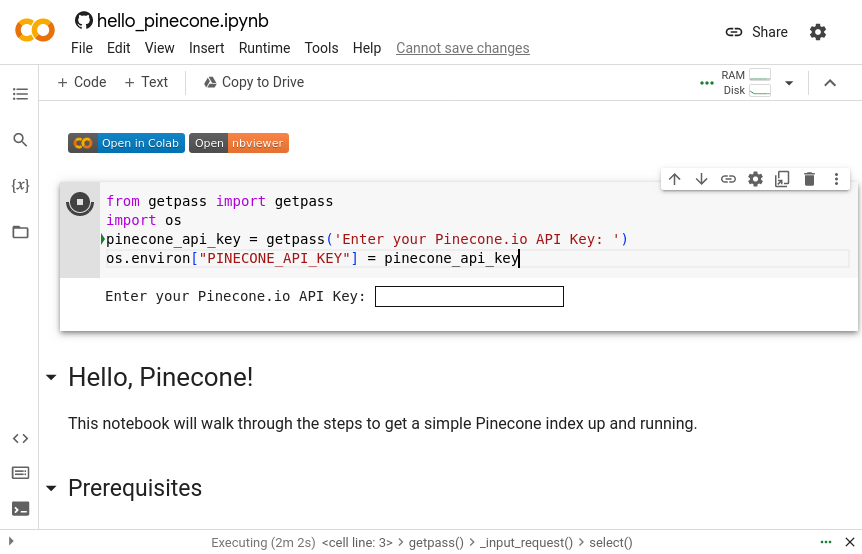

# Pinecone Examples


# What is this repo?

This repository is a collection of sample applications and Jupyter Notebooks that you can run, download, study and modify in order to get hands-on with 
Pinecone [vector databases](https://www.pinecone.io/learn/vector-database/) and common AI patterns, tools and algorithms.

These examples are ideal for learning and expanding your knowledge of what's possible, but if you're looking for production-ready examples, please see the [docs](../docs) folder.

Each individual example notebook lives in its own directory. A notebook file ends in `.ipynb`, and each individual Notebook demonstrates a different AI technique or usage pattern. 

# How to use Jupyter Notebooks to do AI tasks

This video walks through how to load these Notebooks and get started with Google colab. It is intended as a complement to this getting started guide:

[](https://www.youtube.com/watch?v=1Z8T36sZ9WI)

# Getting started 

Running the examples in this repo requires two things, both of which are free: 
1. a Pinecone account, represented by an API key
1. a place to run the example Notebooks. In this case, we'll be using Google Colab

## Step 1. Create a Pinecone account

These example notebooks require a Pinecone API key to run, because they create and query Pinecone vector database indexes.

Pinecone offers a generous free tier that's ideal for learning and experimenting, and even building applications that leverage vector databases.

Head over to [the Pinecone dashboard](https://app.pinecone.io/) and create a new account, which you can do in under a minute. 

## Step 2. Get your Pinecone API key and environment value

On the left-hand side of the Pinecone dashboard, click the API Keys header. You'll have a default API key already available. **_Your API Key is a secret - don't share it or commit it to version control_!**



Remember to take note of your environment too, for example: `us-west4-gcp-free`. You'll need this environment value when initializing Pinecone in any project.


## Step 3. Run a notebook via Google Colab

While logged into a Google account, visit [Google Colab](https://colab.research.google.com/). This is a Google service which allows you to run Jupyter Notebooks on Google infrastructure to greatly simplify experimenting, exploring and sharing your results 
without needing to worry about creating or managing cloud compute environments.

## Step 4. Perform the one-time setup for Google Colab 

You will only need to complete these next steps one time, and can then skip them in the future when running additional example Notebooks.

If the example Notebook you want to run has an Open in Google Colab button, you can click it in order to get started. It will look like this:


Otherwise, Start by clicking File > Open Notebook in the top left menu of Google Colab and be sure to click the GitHub tab. You can then either: 

Paste the full URL (including the `.ipynb` extension) into the URL bar in the modal, or you can enter `pinecone-io` (which is the Pinecone GitHub organization name) and then enter `pinecone-io/examples` in the repository field: 



Next, click the the name of the Notebook you want to run in the list that appears in the middle of the modal.

If this is your first time using Google Colab, you are likely to run into one or both of the two following issues: 

**Ensure you have granted Google Colab access to your GitHub account**

If you get an error message like this, click the Authorize with GitHub button and click through the GitHub authorization window to grant Google Colab the ability to load Jupyter Notebooks via your GitHub account.



**Ensure Google Colab has permission to open pop-up windows**

You may also run into an error stating that you need to grant Google Colab permission to open pop-up windows. If you do, look for the UI element in your web browser asking you to grant permission to Google Colab, and grant it permission to open pop-up windows.



With those steps complete, you can re-try opening your desired Notebook and it should load correctly: 



### Step 4. Securely set your Pinecone API key 

As a best practice, you should never hardcode credentials such as an API key into any source code, such as a Jupyter Notebook, because it's easy to accidentally share or commit the key unintentionally, leading to compromise of your account and its resources. 

The Pinecone example Jupyter Notebooks expect a Pinecone API key available in the `PINECONE_API_KEY` environment variable, and a Pinecone environment variable (such as `us-west4-gcp-free`) which you can find in the [Pinecone console](https://app.pinecone.io).

One way you can set your Pinecone API key securely in your Jupyter Notebook on Google Colab is to create a new cell that uses the `getpass` utility to prompt you for a secret, using a masked / password input field which hides the characters you enter from view, 
which you can then export into an environment variable: 



To implement this workflow, you can click the `+ Code` button at the top of the menu and paste the following code into it: 

```python
from getpass import getpass 
import os
pinecone_api_key = getpass('Enter your Pinecone API Key: ')
os.environ["PINECONE_API_KEY"] = pinecone_api_key
```
When you click the right-facing arrow to run this code, you'll be prompted with the secure input field as shown in the above screenshot and you can paste your Pinecone API key into this field, which will hide your key from view, yet also make it available to subsequent 
Notebook cells by setting the `PINECONE_API_KEY` environment variable.


### Step 5. Experiment, learn and enjoy!

With these steps complete, you're ready to work through the Notebook to learn AI concepts and get hands-on experience using the world's most performant, cloud-native vector database.

## We love feedback! 

As you work through these examples, if you encounter any problems or things that are confusing or don't work quite right, please [open a new issue :octocat:](https://github.com/pinecone-io/examples/issues/new).

## Getting support and further reading 

Visit our: 
* [Documentation](https://docs.pinecone.io)
* [Support forums](https://community.pinecone.io)

## Collaboration

We truly appreciate your contributions to help us improve and maintain this community resource!

If you've got ideas for improvements, want to contribute a quick fix like correcting a typo, or patching an obvious bug, feel free to open a new issue or even a pull request. If you're considering a larger or more involved change to this repository, its organization or the functionality of 
one of the examples, please first [open a new issue :octocat:](https://github.com/pinecone-io/examples/issues/new) and state your proposed changes so we discuss them together before you invest a ton of time or effort into making changes. Thanks for your understanding and collaboration. 
